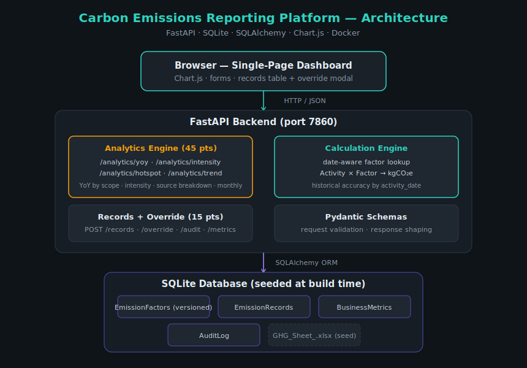

# Carbon Emissions Reporting Platform

A prototype platform for tracking, calculating, and visualizing organizational
greenhouse-gas (GHG) emissions under the **GHG Protocol**, with a focus on
**Scope 1 (direct)** and **Scope 2 (indirect)** emissions. Built for a steel-plant
emissions inventory, it provides a versioned emission-factor engine, advanced
analytics (year-over-year, intensity, hotspots), a manual-override workflow with a
full audit trail, and an interactive dashboard.

**Author:** Abhinav Nirapure · B.Tech Data Science & AI, IIIT Naya Raipur
**Stack:** Python · FastAPI · SQLAlchemy · SQLite · Chart.js · Docker

- **Live demo:** https://huggingface.co/spaces/abhinaviiitnr/ghg-emissions-platform
- **Source:** https://github.com/abhinaviiitnr/ghg-emissions-platform

---

## What it does

1. Ingests a steel-plant activity dataset (Scope 1 & 2) from an Excel workbook.
2. Stores **versioned emission factors** with validity date ranges, so emissions are
   always calculated with the factor that was valid **on the date of the activity**.
3. Exposes **analytical APIs** — year-over-year emissions by scope, emission intensity
   per tonne of product, and emission hotspots by source.
4. Supports **creating records** and **manually overriding** calculated values, with
   every override written to an immutable **audit log**.
5. Serves an **interactive dashboard** (four ESG visualizations + data-entry forms).

---

## Architecture



The system is a single FastAPI service that serves both the JSON API and the static
dashboard, backed by a SQLite database seeded at container-build time. Three layers:

- **Frontend** — a single-page Chart.js dashboard (no build step) that calls the API.
- **Backend** — FastAPI, organized into a *calculation engine* (date-aware factor
  lookup), an *analytics engine* (the four reporting queries), a *records/override*
  layer, and *Pydantic schemas* for validation.
- **Data** — SQLite via SQLAlchemy ORM, with four tables (below). The database is
  built into the image at build time from `data/raw/GHG_Sheet_.xlsx`, so every
  deployment is reproducible and resets to a known-good state on restart.

---

## Database schema

The schema is designed around one principle: **the factor is not stored on the
record**. Records hold the activity; factors live in a separate versioned table and
are resolved by date at calculation time. This is what makes "historical accuracy"
real rather than cosmetic.

### `emission_factors`  (versioned master data)
| Column | Type | Notes |
|---|---|---|
| id | int PK | |
| activity_name | str | e.g. "Diesel", "Grid - State Utility" |
| scope | int | 1 or 2 |
| unit | str | unit of the activity (KL, kWh, tonnes…) |
| co2e_factor | float | **kgCO₂e per unit** |
| source | str | e.g. "IPCC 2006 Guidelines" |
| valid_from | date | start of validity |
| valid_to | date / null | end of validity; **null = currently active** |
| version | int | 1, 2, … per activity |

For any (activity, date), exactly one factor row is valid. A 2023 activity resolves
to the v1 (2023) factor; a 2024 activity to the v2 (2024) factor.

### `emission_records`  (activity log)
| Column | Type | Notes |
|---|---|---|
| id | int PK | |
| activity_name | str | resolved to a factor by name + date |
| scope | int | 1 or 2 |
| section | str | plant section (e.g. "Pellet Plant") |
| quantity | float | the activity data |
| unit | str | |
| activity_date | date | **drives factor selection** |
| calculated_emissions | float | kgCO₂e, computed at write time |
| factor_id_used | int FK | which factor version was applied (traceability) |
| is_overridden | bool | true if a manual override was applied |
| created_at | datetime | |

### `business_metrics`  (production figures, for intensity)
| Column | Type | Notes |
|---|---|---|
| id | int PK | |
| metric_date | date | |
| metric_name | str | e.g. "Tonnes of Steel Produced" |
| value | float | |

### `audit_log`  (override trail)
| Column | Type | Notes |
|---|---|---|
| id | int PK | |
| record_id | int FK | the overridden record |
| field_changed | str | e.g. "calculated_emissions" |
| old_value | str | value before override |
| new_value | str | value after override |
| reason | str | required justification |
| changed_at | datetime | |

---

## API reference

| Method | Path | Description |
|---|---|---|
| GET | `/health` | Liveness check |
| GET | `/info` | Counts + available date range |
| GET | `/activities` | Known activities with unit/scope/section (drives the form dropdowns) |
| GET | `/analytics/yoy?year=YYYY` | Total emissions by scope, current vs previous year |
| GET | `/analytics/intensity?year=YYYY` | kgCO₂e per tonne of product for the year |
| GET | `/analytics/hotspot?year=YYYY&top_n=N` | Emissions by source, top-N + "Other" |
| GET | `/analytics/trend?year=YYYY` | Monthly emission totals (12-month series) |
| POST | `/records` | Create a Scope 1/2 record (factor resolved by date) |
| POST | `/records/{id}/override` | Override a record's emissions (writes an audit row) |
| GET | `/records/{id}/audit` | Full audit history for a record |
| GET | `/records?limit=N` | Recent records (for the dashboard table) |
| POST | `/metrics` | Add a business metric |

Interactive API docs are available at `/docs` (FastAPI / Swagger UI).

---

## Running locally

**Prerequisites:** Python 3.11+ (developed on 3.14) and the dependencies in `requirements.txt`.

```bash
# 1. Clone
git clone https://github.com/abhinaviiitnr/ghg-emissions-platform.git
cd ghg-emissions-platform

# 2. Create & activate a virtual environment
python -m venv venv
venv\Scripts\activate            # Windows
# source venv/bin/activate       # macOS / Linux

# 3. Install dependencies
pip install -r requirements.txt

# 4. Seed the database (reads data/raw/GHG_Sheet_.xlsx -> data/emissions.db)
python scripts/seed.py

# 5. Run the server
uvicorn api.main:app --reload --port 8000
```

Open **http://127.0.0.1:8000/** for the dashboard or **/docs** for the API.

---

## Running with Docker

The entire system (API + dashboard + seeded DB) runs in one container.

```bash
docker build -t ghg-platform .
docker run -p 7860:7860 ghg-platform
```

Open **http://127.0.0.1:7860/**. The database is seeded during the build, so the
container is fully self-contained.

---

## Data provenance & honest limitations

This section documents exactly how the demo data was derived, because part of the
task was constructing a versioned, multi-year model from a single-year source.

**Source.** `data/raw/GHG_Sheet_.xlsx` — a steel-plant inventory with Scope 1 and
Scope 2 activity rows (material/energy, quantity, an emission factor, and a quarter
label). It contains **no year dimension** and **no factor versioning**.

**Constructed elements (clearly synthetic):**
- **Unit conversion.** Source factors are in tCO₂/unit; they are multiplied by 1000
  and stored as **kgCO₂e/unit** to match the assignment's stated unit.
- **Two-year history.** The sheet is treated as **2024** (current year). A **2023**
  prior year is synthesized: factors scaled ×0.95 (a documented "methodology drift")
  and activity quantities scaled down per-activity by a fixed-seed random factor in
  [0.88, 0.95]. This produces a realistic mixed YoY change and lets the date-aware
  factor lookup be demonstrated. All synthesis is deterministic (`random.seed(42)`).
- **Business metrics.** The sheet has no production figures, so monthly
  "Tonnes of Steel Produced" values are constructed for both years to support the
  intensity metric.

**Known limitation (faithful ingestion over curation).** The source sheet classifies
many non-combustion materials (process gases, industrial gases such as Argon/Oxygen,
and intermediates such as Sponge Iron and Hot Metal) as Scope 1 inputs. As a result,
**absolute emission totals and the intensity figure are inflated** relative to a real
steel plant (~2 tCO₂e per tonne). The platform **ingests the provided data faithfully
rather than curating it**, because the assignment evaluates the correctness of the
*system* — the factor versioning, the date-aware calculation, and the analytics — and
those are correct on whatever data they are given. Curating the input would have meant
silently overriding the source. The fix, in a production setting, would be to refine
the Scope 1 classification in the master data; the engine itself would not change.

---

## Working prototype — screenshots

**Dashboard (four ESG visualizations):**


**Manual override with audit trail:**


**Historical accuracy — same activity, different dates resolve to different factors:**


**Analytics API (live response):**


**Deployed and running on Hugging Face Spaces:**


## Project structure

```
ghg-emissions-platform/
├── api/
│   ├── main.py           # FastAPI app: routes + serves the dashboard
│   ├── database.py       # SQLAlchemy engine + session
│   ├── models.py         # the four ORM tables
│   ├── schemas.py        # Pydantic request/response models
│   ├── calculations.py   # date-aware factor lookup + Activity × Factor
│   └── analytics.py      # YoY / intensity / hotspot / trend queries
├── scripts/
│   └── seed.py           # builds & populates the DB from the Excel source
├── frontend/
│   └── index.html        # single-page Chart.js dashboard
├── data/
│   └── raw/GHG_Sheet_.xlsx
├── docs/
│   └── architecture.svg
├── Dockerfile
├── requirements.txt
└── README.md
```
